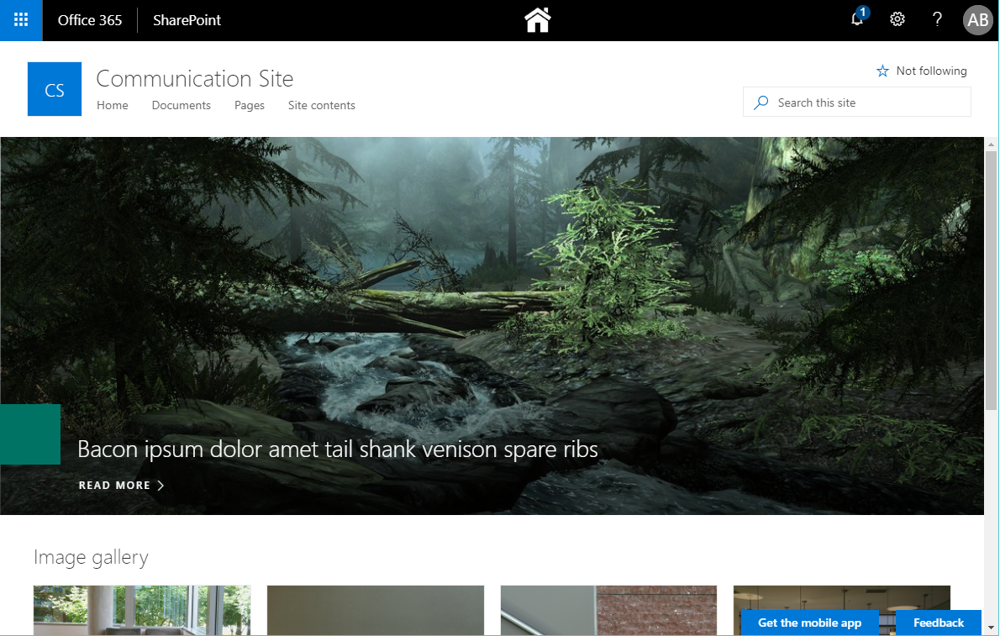
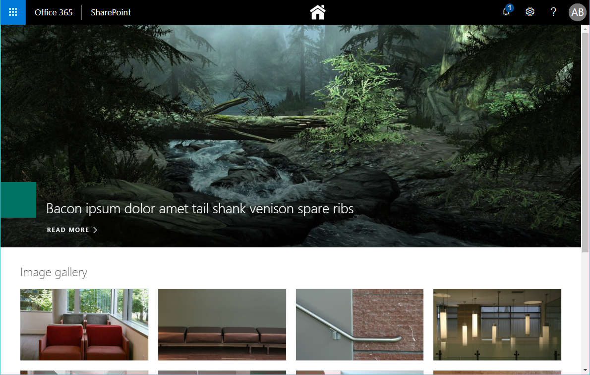

# SharePoint Full Page Canvas App

This solution is created with [SharePoint Framework](https://docs.microsoft.com/en-us/sharepoint/dev/spfx/sharepoint-framework-overview) for SharePoint Online.

A common requirement in the past with classic SharePoint solutions was to create start pages utilizing the full canvas of the page. In classic SharePoint this could easily be accomplished by adding a few lines of CSS in a Page Layout.

For modern pages we don't have Page Layouts anymore, and to accomplish the same result a SPFx Extention can be used. This is more spesific a Application Customizer registering one simple CSS override in the top placeholder of the page.

This solution will work with both Communication and Team Sites, but is recommended to be used with Communication Sites. This template will give us full control of the page canvas below the Office 365 suite bar. Using it on a Team Site will not make much sense as we have a different layout with a left navigation bar etc.

### Common usage scenarios

* Intranet front page
* Global start page
* Full page apps hosted in SharePoint Online

### Example of communication site before the app is added



### Example of communication site after the app is added




## Getting started

```bash
git clone the repo
npm install
gulp serve
```

## Depoyment and usage

Build the app with:

```bash
gulp bundle --ship
gulp package-solution --ship
```

Enable the app:

1. Upload the file "spfx-extension-fullpagecanvas.sppkg" from  "/sharepoint/solution" to the App Catalog.
2. Go to either a modern Communication or Team Site.
3. Go to "Site contents" and add new "App"
4. Select "spfx-extension-fullpagecanvas" and wait for it to be installed
5. Go to the front page and check if the header of the page is now hidden